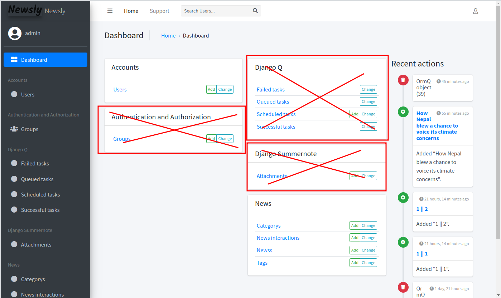
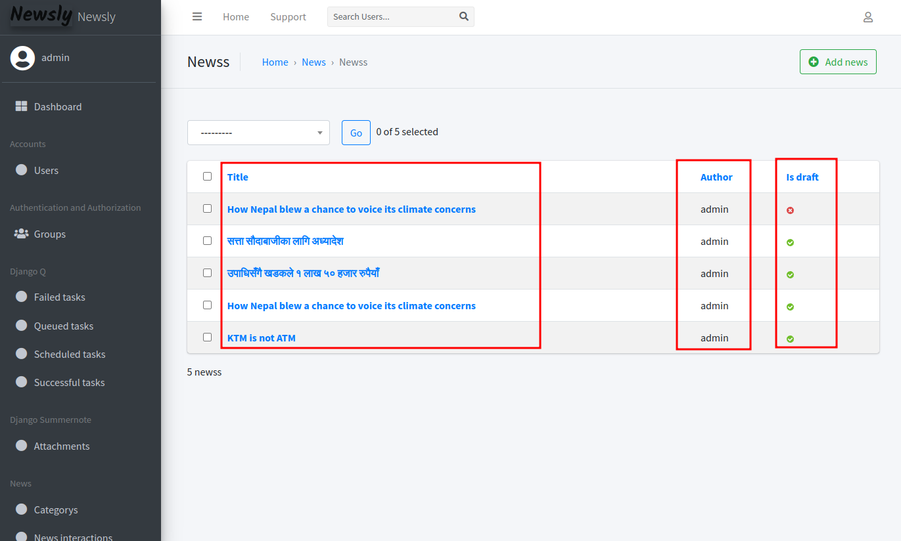

# Newsly
## How to use the software
*It is assumed that you already have this software setup and running as per the instructions below.*

Please visit http://localhost:8000, and you will be greeted with following page.

Login using the credentials that you have created at the setup phase.

Now, after login you will be visited with the following fields.

You can ignore those that have been marked with a cross.

**The news interaction module is used to power the recommendation api, please don't manipulate it**

Our main focus of concern is in the News Module:

We can add new category, tags and News using this module. 

The category and tags module are very simple, and they don't require much knowhow to use.
#### List of all categories

#### Adding a New Category

#### Adding a new TAG

### Adding a News
#### Viewing all news

You can view all the news in this view. The first box lists all the news. The 2nd column in same row represents who wrote the news and the final represents weather to show this news to user or not, i.e. weather to publish it?

#### Adding a news
In order to add the news, press `Add` button. After which you will be redirected to this UI.

#### Publishing a news (Undrafting it)

## How to Set up
Steps:
1. Clone the GitHub repository
2. Install Python3 and PIP
3. Run `pip install -r requirements.txt`
4. Set up all the environment variables given below.
5. Create a database and set up DATABASE_URL as given by the format in https://pypi.org/project/dj-database-url/
6. Run `python manage.py migrate`
7. Run `python manage.py createsuperuser` and create admin user
8. Run `python manage.py runserver` and connect to the website using http://localhost:8000

### Environment Variables
- `NEWSLY_SECRET_KEY`
  - String block used for cryptographic transactions. Generated random value to be used. 
- `NEWSLY_DEBUG`
  - True | False
- `NEWSLY_ALLOWED_HOST`
  - Comma seperated list of hosts that are allowed to point to the server. 
    - Example "localhost,newsly.pp.ua"
    - Use "*" if you want this to be accessed by any domain. 
- `NEWSLY_DATABASE_URL`
  - URL DSN in the form: `postgres://postgres@database_default:5432/db
`