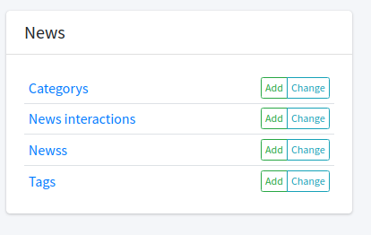

# Newsly

## About
This project was created as a part of a program at Leapfrog Technologies, INC. We were assigned a topic to Revamp and make it better. Our topc was News Portal, for which we won the 1st prize. 

### NOTE:
**This project was created in a limited timescope. Hence, the code is not suitable to be referenced for any other purposes. We have cut many corners just to bring this project to life. As a result the code many not reflect the indrustry standard way of doing things or correct way to do those things.**

### Team
The team comprised of 5 people with following distribution.


#### Backend Development
Backend Development was solely handled by
1. [Saurav Adhikari](https://github.com/ErSauravAdhikari/) (The owner of this repo). 

#### Frontend Development
The code for Frontend Development lies here: [Frontend Code](https://github.com/nadika18/Newsly_frontend/)
The developers were:
1. [Nadika Paudel](https://github.com/Nadika18)
2. [Aabhusan Aryal](https://github.com/aabhusanaryal)
3. [Yunika Bajracharya](https://github.com/Yunika-Bajracharya)

## How to use the software
*It is assumed that you already have this software setup and running as per the instructions below.*

Please visit http://localhost:8000 (for self deployment) or https://newsly.asaurav.com.np/ (if you didn't deploy yourself), and you will be greeted with following page.


Login using the credentials that you have created at the setup phase.

Now, after login you will be visited with the following fields.


**The self interaction module is used to power the recommendation api, please don't manipulate it**

Our main focus of concern is in the News Module:


We can add new category, tags and News using this module. 

The category and tags module are very simple, and they don't require much knowhow to use.
#### List of all categories


#### Adding a New Category


#### Adding a new TAG


### Adding a News
#### Viewing all self


You can view all the self in this view. The first box lists all the self. The 2nd column in same row represents who wrote the self and the final represents weather to show this self to user or not, i.e. weather to publish it?

#### Adding a self
In order to add the self, press `Add` button. After which you will be redirected to this UI.


**You are not to fill the fields inside the red box. Those will be automatically processed. After which you can edit them at later.**
After filling up the fields, press the save button.  

#### Push self to be automatically processed
Each self can be processed using state of the art Artificial Intelligence models.

Although AI can do most of the task, a human is required to make sure that what it did is correct and fix this. 

In order to trigger this automatic processing, visit the list view of self and select the self you want to process.
_You can select multiple self._

After which in the dropdown as shown below press the process button and press go


After pressing go, we get a confirmation


Now sit back and relax as you let the AI do the job.

#### Process viewing and editing
AI can do amazing things but in some cases they do it wrong. So in order to prevent incorrect self being sent to the user, we need to supervise it.

Hence, after the AI finished processing the author will receive an email, in the address which he added during account creation or was added by admin.

The email will look something like this.


The author can now review the AI's work. If this needs any modification, the author or editor can go and edit the self by clicking on the self title in list view.


The edit view looks same as the create view, but it has the fields those when we added were empty.


After the edit has been completed, the author has to redo the TTS (if summary has been edited). This is done in similar way as the full process trigger.


In this way the author can add self. Now it's time to publish it so the user can view it from the app.

#### Publishing a self (Undrafting it)
In the list view, press the publish button and press go.


This will set the is_draft to be false allowing users to now view the self.

_One thing to take note is that, if the Automated processing has not been done or if summary, and tts have not been added, even after publishing it, it won't be shown to users as it is not complete._

## How to Set up
Steps:
1. Clone the GitHub repository
2. Install Python3 and PIP
3. Run `pip install -r requirements.txt`
4. Set up all the environment variables given below.
5. Create a database and set up DATABASE_URL as given by the format in https://pypi.org/project/dj-database-url/
6. Run `python manage.py migrate`
7. Run `python manage.py createsuperuser` and create admin user
8. Run `python manage.py runserver` and connect to the website using http://localhost:8000

### Environment Variables
#### Important variables
- `NEWSLY_SECRET_KEY`
  - String block used for cryptographic transactions. Generated random value to be used. 
- `NEWSLY_DEBUG`
  - True | False
- `NEWSLY_ALLOWED_HOST`
  - Comma seperated list of hosts that are allowed to point to the server. 
    - Example "localhost,newsly.pp.ua"
    - Use "*" if you want this to be accessed by any domain. 
- `NEWSLY_DATABASE_URL`
  - URL DSN in the form: `postgres://postgres@database_default:5432/db
`
#### Full list of variables
```dotenv
AZURE_ACCOUNT_KEY=<Azure Storage Account Key> 
DATABASE_URL=<DB_URL>
DJANGO_SETTINGS_MODULE=config.settings
EMAIL_HOST=<SMTP host address>
EMAIL_HOST_PASSWORD=<Emails Password>
EMAIL_HOST_USER=<Email Address>
EMAIL_PORT=<SMTP Port>
EMAIL_USE_SSL=<True or False>
IBM_WATSON_TTS_AUTHORIZATION=<Watson Auth Parameter in format: Basic <encoded_key>>
IBM_WATSON_TTS_URL=<Watsons url given in watson dashboard>
NEWSLY_DEBUG=<True for Local Setup, False for Production>
NEWSLY_SECRET_KEY=<A random secret key>
OPENAI_API_KEY=<OPENAI api key>
PYTHONUNBUFFERED=1
TG_BOT_TOKEN=<Telegram Bot Token>
```
